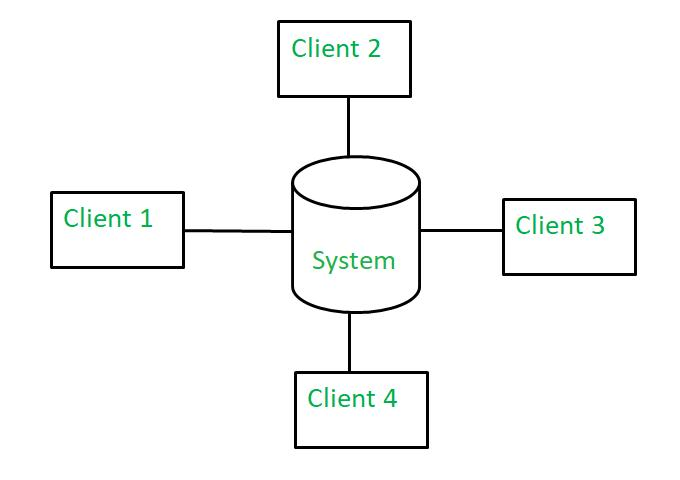
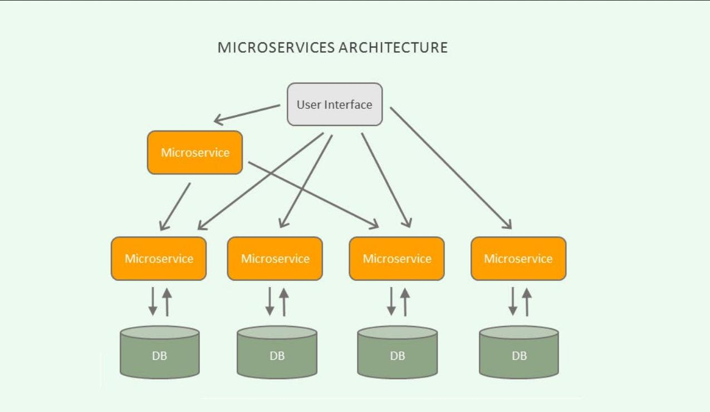

# 📘 PROJETO 3: Definição de Arquitetura para um Sistema Real

# 🧩 PROBLEMA

Uma empresa deseja desenvolver um sistema chamado: “Sistema de Gestão de Pedidos Online para uma Lanchonete”

Atualmente, os pedidos são feitos de forma desorganizada:

- Clientes pedem pelo WhatsApp
- Pedidos se perdem
- Não há controle de fila
- Cozinha se confunde com os pedidos
- Não há controle de entrega

A empresa deseja um sistema que:

- Organize pedidos
- Controle status (em preparo, pronto, entregue)
- Permita acompanhamento dos pedidos
- Centralize as informações

Você é responsável por **definir a arquitetura desse sistema antes do desenvolvimento**.

# 📋 PROJETO

O sistema deve:

### Requisitos Funcionais

```
RF01 - O sistema deve permitir registrar pedidos.
RF02 - O sistema deve permitir atualizar status do pedido.
RF03 - O sistema deve permitir visualizar pedidos em andamento.
RF04 - O sistema deve permitir controle de entrega.
RF05 - O sistema deve permitir acesso por clientes e funcionários.
```

### Requisitos Não Funcionais

```
RNF01 - O sistema deve ser rápido.
RNF02 - O sistema deve funcionar em celular.
RNF03 - O sistema deve suportar vários pedidos simultâneos.
```

# 🧠 DESENVOLVIMENTO DO PROJETO

## 🔹 ETAPA 1 — Escolha da Arquitetura

```
MONOLÍTICO | CLIENTE-SERVIDOR | MICROSSERVIÇOS
```

Você deve:

1. Escolher uma arquitetura.
2. Justificar a escolha.

## 💡 Exemplo de uma resposta:

```
Escolha: Cliente-Servidor

Justificativa:
Permite vários clientes acessarem o sistema,
centraliza dados e facilita controle dos pedidos.
```

Você pode se perguntar para montar a justificativa:

- O sistema precisa crescer?
- Quantos usuários?
- É simples ou complexo?

## 🔹 ETAPA 2 — Desenho da Arquitetura

Agora você deve representar o sistema.

## 🖊️ Modelo de Cliente-Servidor

```
[ Cliente (Celular) ]
         ↓
[ Servidor ]
         ↓
[ Banco de Dados ]
```



## 🖊️ Modelo Microsserviços

```
[ App ]
   ↓
[ Serviço Pedidos ]
[ Serviço Entrega ]
[ Serviço Usuário ]
```



#### 🧠 LEMBRETE: Esses acima são modelos para você se basear no momento que for desenhar a arquitetura nas ferramentas de apoio, **NÃO É PARA FAZER IGUAL**!!!

Você deve desenhar em uma das ferramentas de apoio a arquitetura:

- Usuários (clientes/funcionários)
- Sistema
- Banco de dados
- Fluxo de comunicação


## 🔹 ETAPA 3 — Organização dos Componentes

Agora detalhar o sistema.

```
USUÁRIO
 ↓
INTERFACE
 ↓
PROCESSAMENTO
 ↓
BANCO
```

Você deve identificar:

- Quem usa o sistema
- Quais telas existem
- Onde acontece o processamento
- Onde ficam os dados

## 💡 Exemplo:

```
Usuário → Cliente e Funcionário
Interface → App ou site
Processamento → Servidor
Banco → Banco de pedidos
```

# 📦 Entrega do Projeto

O projeto deve ser entregue em PDF e **formatado nas regras da ABNT** (https://blog.mettzer.com/normas-abnt/). A documentação deve está na pasta do projeto com nome `projeto3-definicao-de-arquitetura-SEU-NOME.pdf`.

O projeto não segue um modelo padrão, então você pode caprichar de acordo com seu entendimento. Só não seja preguiçoso(a)!

Boas práticas! 🤙